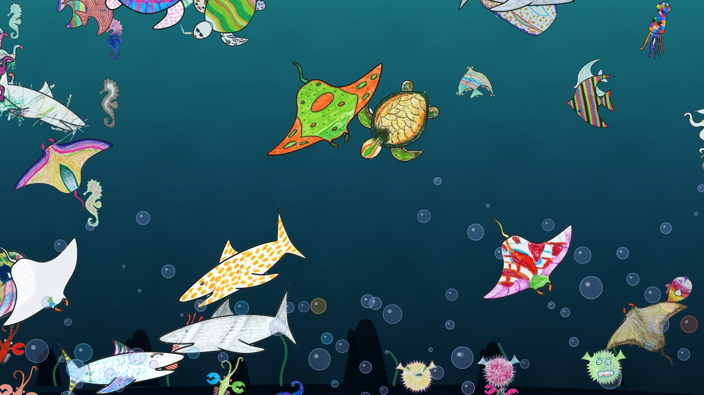

# 🐠 Fish Party

**Colour a fish. Watch it swim.** An aquarium where every creature was drawn by
someone: guests colour one of 12 sea creatures (on paper or on their phone) and it
joins the others on a projected wall, among bubbles that are live Bitcoin
transactions.

Inspired by teamLab's [Sketch Aquarium](https://futurepark.teamlab.art/en/playinstallations/sketch_aquarium/).
This is a small, free, open-source take on the idea that runs on one laptop.



## Throw your own party in 5 minutes

```sh
git clone https://github.com/Rogzy-DB/fish-party && cd fish-party
python3 -m venv .venv && .venv/bin/pip install -r requirements.txt
.venv/bin/python tank/serve.py --host 0.0.0.0 --port 8000
```

- **The wall** (projector or TV browser): `http://<your-computer>:8000/`
- **Guests** (phones on your Wi-Fi): `http://<your-computer>:8000/draw` to paint,
  `/upload` to photograph a coloured sheet
- **You**: `/settings` (fish size, sound, hide a fish) · `/review` (drawings the
  recogniser wasn't sure about)
- **Paper**: print [`templates/all-12-templates.pdf`](templates/all-12-templates.pdf)

The full checklist (hardware, Wi-Fi, music, what goes wrong on the night):
[docs/HOST-A-PARTY.md](docs/HOST-A-PARTY.md).

## How it works

| | |
|---|---|
| `tank/` | The aquarium (PixiJS) and its server, `serve.py` (Python stdlib only). Every species has its own behaviour in `tank/static/species.json`. |
| `recognizer/` | Cuts a photographed drawing out of the paper and tells which of the 12 outlines it is (OpenCV silhouette + feature matching), then turns it the right way up. Unsure → the review tray, never a guess. |
| `templates/` | The 12 A4 colouring sheets. Their outlines are the recogniser's references. |
| `site/` | The showcase website. |
| `demo/party/` | 46 real fish from the party where it all started (CC BY-NC). |

**Bubbles:** each one is a real transaction waiting in the Bitcoin mempool; size =
amount, colour = fee rate. A new block flashes the water gold. Data from
[mempool.space](https://mempool.space) by default, or your own node:
`MEMPOOL_API=http://127.0.0.1:8999`. No internet → mock bubbles, the fish don't mind.

**All state lives in one folder** (`FISH_DATA`, default `./data`): the fish PNGs,
`labels.json`, `settings.json`. Back it up, copy it, delete it to start over.

## Three modes

`TANK_MODE` decides who can do what:

| mode | for | new fish | owner pages |
|---|---|---|---|
| `home` (default) | your party, your network | swim at once | open |
| `public` | a tank on the internet | wait for your OK in `/review` | need `ADMIN_PASSWORD` (user `admin`) |
| `showcase` | a read-only display | not accepted | none |

Putting a tank online: [docs/DEPLOY.md](docs/DEPLOY.md).
The whole website (site + party tank + shared tank) on your machine:
`ADMIN_PASSWORD=pick-one .venv/bin/python tools/dev.py`, then open http://127.0.0.1:8810/.

## Make it yours

- **Your own creatures:** draw an A4 sheet with a bold, closed black outline, put it
  in `templates/<id>.pdf`, add a row to `recognizer/species.py`, give it a behaviour
  in `tank/static/species.json`, then run `recognizer/build_references.py` and
  `tank/build_lineart.py` (they need `pdftoppm`, from poppler-utils).
- **Music:** drop a file at `tank/static/audio/ambient.mp3` (or `.m4a`/`.ogg`/`.mp4`);
  a 🔊 button appears. Never commit a track you don't own (it's gitignored).
- **Scenes:** backgrounds and decorations are data, in `tank/static/scenes.json`.

## Tests

```sh
.venv/bin/python -m unittest discover -s tests
```

## Credits

Made by Rogzy & Luna.

## Licence

Code: MIT. Party drawings (`demo/party/fish/`): CC BY-NC 4.0. PixiJS: MIT.
